## Regression Results

Here we provide the results for regression problems. 

We adapt the experiments as follows:
* We use all TFMs that support regression (LimiX-2M, LimiX-16M, TabPFN V2, and TabPFN 2.5).
* We use negative RMSE as the primary performance metric and additionally report Spearman’s rank correlation, which is invariant to calibration.
* The separation gap experiment is extended to regression by treating regression as a classification problem.
* We adapt TabICL priors to regression tasks.
* All six regression tasks in TabArena with fewer than 100 features and 10,000 samples are included, with experiments run using the repetitions and folds specified by TabArena.
* We evaluate our proof-of-concept model on regression tasks.

### Exp 1. Embedding Similarity

  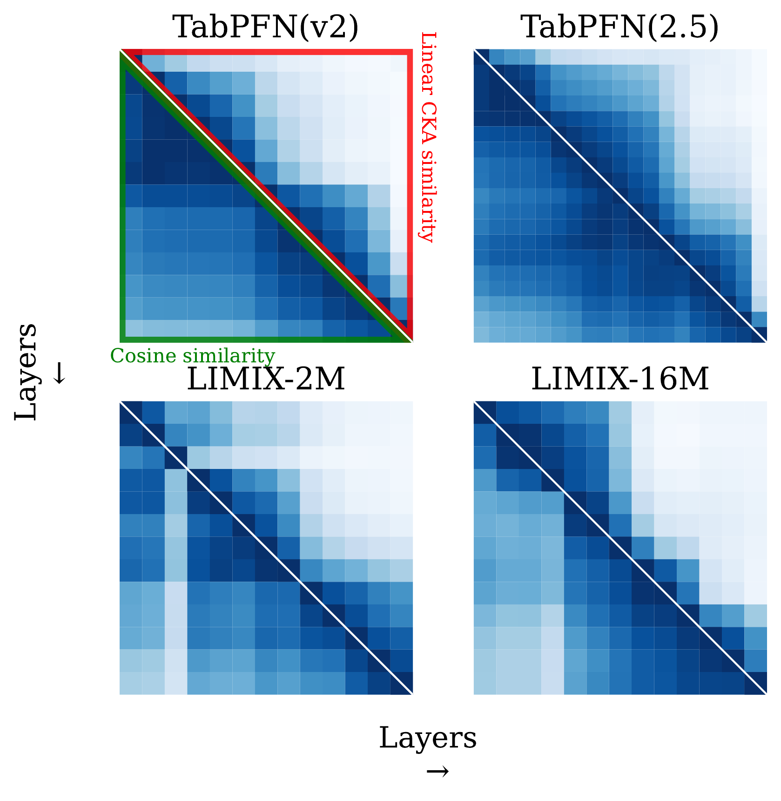
  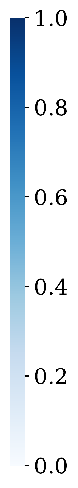

In regression tasks, TFMs also form blocks in which the embeddings remain similar.

---

### Exp 2. Separation Gap

  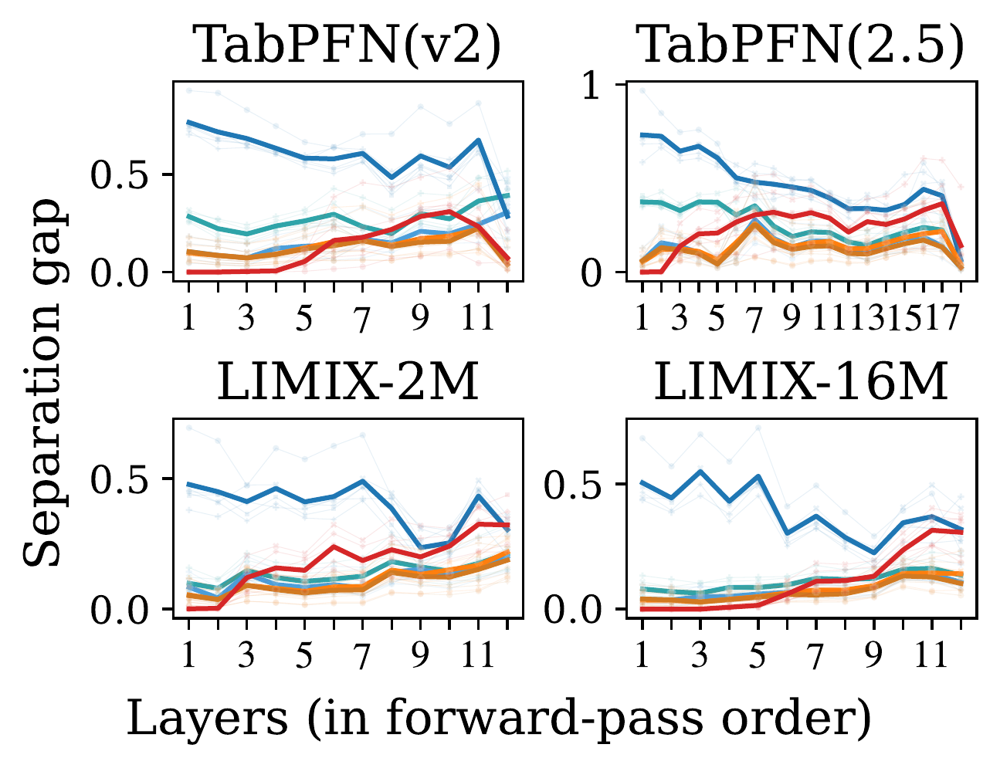
  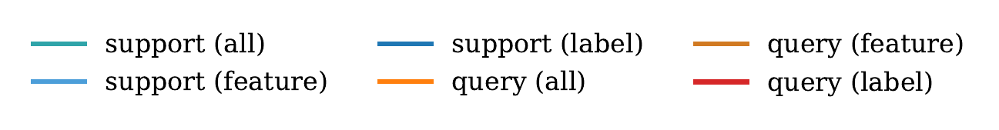

We extend our separation gap metric to regression tasks by treating regression as classification. Specifically, the regression values are discretized into K=10 bins, and the separation gap is defined as the difference between the intra-bin and inter-bin distances. We highlight that for the regression tasks a higher separation gap is not necessarily corresponding to better performance. 

---

### Exp 3. Probing Experiment

  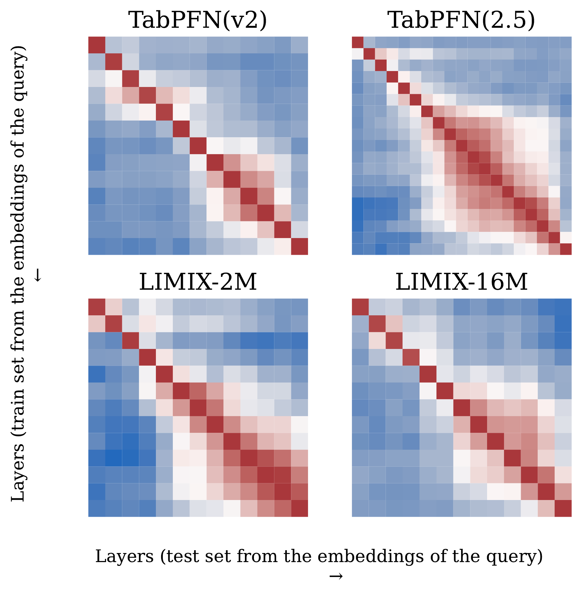
  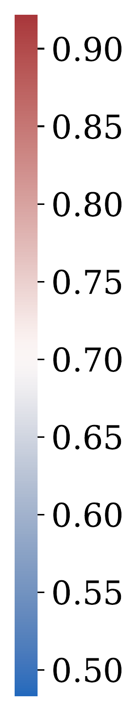 &nbsp;&nbsp;

For the probing regressor, we employ a random forest regression model instead of logistic regression (for classification tasks). The results show that for regression tasks (similar to classification) each layer cumulatively enriches the representation by adding new features while preserving previous ones.

---

### Exp 4. Tabular Logit Lens

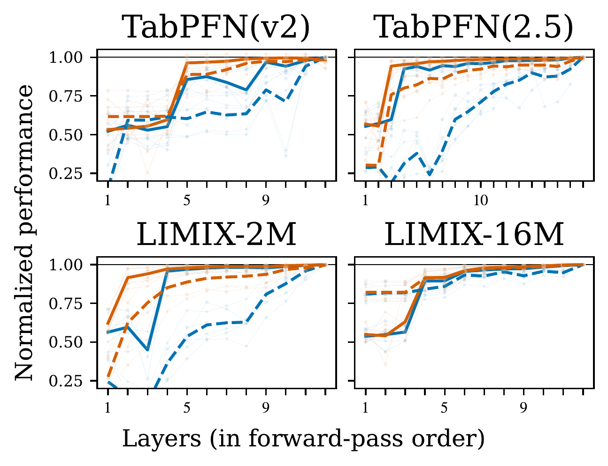
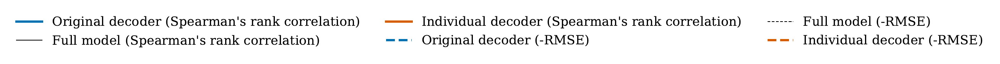

For this experiment, we adapt TabICL priors to regression tasks and pretrain individual decoders. We report results using Spearman rank correlation, which is insensitive to calibration, as well as negative RMSE, which is sensitive to calibration. The results indicate the same inference stages as discussed for classification in Appendix C.

---

### Exp 5. Layer Interventions

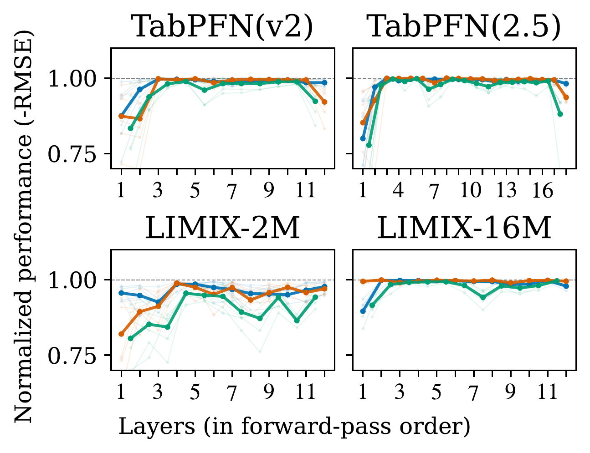
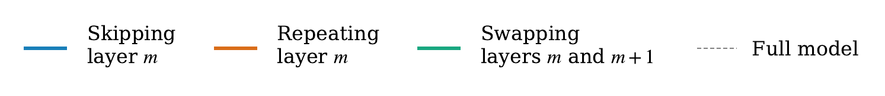

In the layer ablation, we observe the same pattern for the LimiX family. However, for the TabPFN family, the final layer is also found to be important. A possible explanation may stem from the fact that the decoder needs to differentiate between 5,000 bins (classes), and the final layers contribute to the decoding stage. This pattern is analogous to that observed in LLMs.

---

### Exp 6. Self Repair (Skipping Layer)

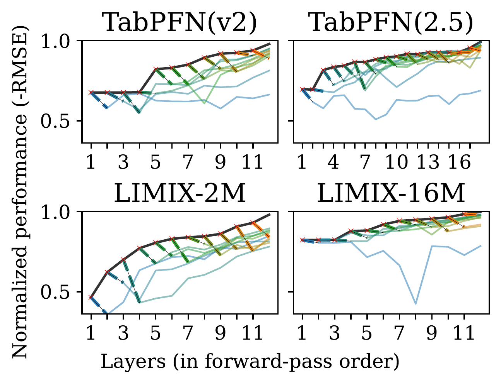

We also observe self-repair behavior: early layers (with the exception of LimiX-2M) are unable to recover.

---

### Exp 7. Looped Transformer (Final Performance)

We evaluate our proof-of-concept model on regression tasks. As shown, the looped variant achieves performance comparable to the 6-layer model, while the single-layer variant fails to recover.

### RMSE (lower is better)

|   dataset | nanoTabPFNlooped | nanoTabPFN6l | nanoTabPFN1l |
|----------:|:---------------------------|:------------------------|:------------------------|
|    363612 | 0.54 ± 0.03                | 0.55 ± 0.03             | 0.94 ± 0.04             |
|    363615 | 0.53 ± 0.04                | 0.47 ± 0.02             | 0.72 ± 0.03             |
|    363625 | 0.47 ± 0.03                | 0.50 ± 0.03             | 1.00 ± 0.06             |
|    363675 | 0.55 ± 0.05                | 0.47 ± 0.04             | 0.80 ± 0.03             |
|    363698 | 0.67 ± 0.04                | 0.67 ± 0.05             | 0.95 ± 0.06             |
|    363708 | 0.84 ± 0.03                | 0.89 ± 0.04             | 1.14 ± 0.04             |

### Spearman's rank correlation  (higher is better)

|   dataset | nanoTabPFNlooped | nanoTabPFN6l | nanoTabPFN1l |
|----------:|:---------------------------|:------------------------|:------------------------|
|    363612 | 0.86 ± 0.02                | 0.85 ± 0.02             | 0.31 ± 0.04             |
|    363615 | 0.84 ± 0.02                | 0.87 ± 0.01             | 0.75 ± 0.02             |
|    363625 | 0.91 ± 0.01                | 0.91 ± 0.01             | 0.33 ± 0.07             |
|    363675 | 0.89 ± 0.02                | 0.89 ± 0.02             | 0.58 ± 0.03             |
|    363698 | 0.79 ± 0.03                | 0.79 ± 0.02             | 0.37 ± 0.06             |
|    363708 | 0.61 ± 0.01                | 0.57 ± 0.01             | -0.02 ± 0.02            |

<!-- 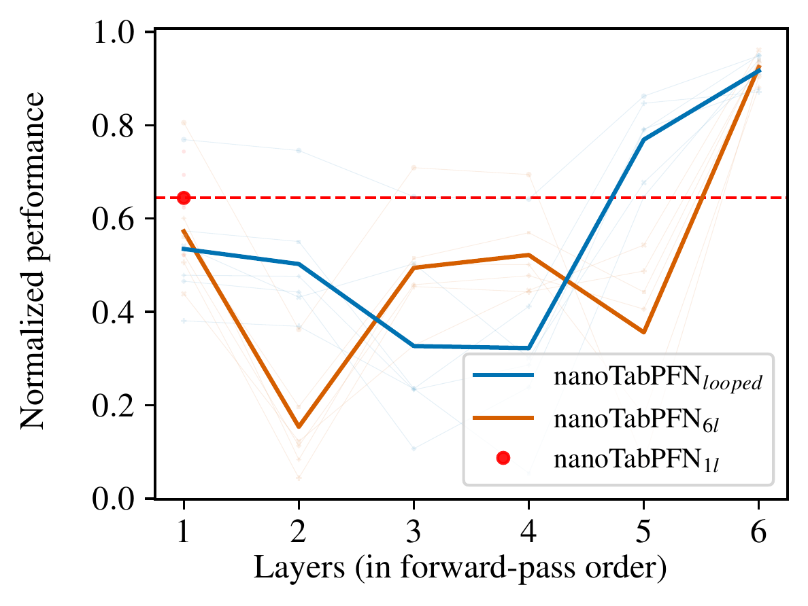

 -->